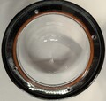

## Images of Allsky Camera Components - click on each one for larger image
### 3D printing settings
+ I used a PRUSA MK3.5S for printing this project
+ PETG filament 
+ Infil 
  + %100 for TOP Assembly, Cover and CPU support 
  + %20 for all other parts
+ Colors
  + Black for TOP Assembly, Cover to alow solar heating to help clear ice, fog and snow on the Optical Dome
  + White for everything else to avoid heating of main tube from Sun - The raspberry Pi gets warn enough on its own

### Overview

### Older Gasket Version

### Raspberry PI

### O-RING version
+ Remove support material from 3D print using a fine flat screw driver
  + insert vertically into the support gap and gently pry up repeat process every 30 degrees until the support releases
  + 
+ O-Ring instalation
  + Lay O-Ring on top of O-Ring slot on print
	+ To avoid stretching o-ring press down into slot using thumbs first at 180 degrees apart, then 90, the 45, etc, until the oring is fully inserted
  + 
  + 
  + 
  + 
  + 
  + 
  + 
### Heatset Inserts
+ Heatset Inserts for CNC Kitchen required for this project
+ These inserts have a narrow lip that fits into the deigned holes
  + 
#### Using a soldering iron to heatset - melt inserts into project holes

+ I just use the default soldering temperature of 350C for doing this
+ Make sure you throughly clean soldering oron tip
  + Suggest using a wet paper towel when the iron is hot - the steam will help with cleaning
  + Make sure you keep the soldering iron vertical 
  + Let insert melt into part untill just below surface
  + 

#### Heatset insert locations
+ M3 x 5.7 inserts are used for holding CPU support onto top assembly with M3 x 12mm flat head tapered philips screws
+ M2.5 x 4 inserts are used for holding camera circuit board onto top assembly and RPI onto CPU support 
  + 
  + 
  + 
  + 
  + 
  + 

### Weather Sensor

### Magnetic Focus Adjustment
  + This permits moving the focus point using a strong external magnet 
  + 

### Image Examples

