## Images of Allsky Camera Components - click on each one for larger image
### 3D printing settings
+ I used a PRUSA MK3.5S for printing this project
+ PETG filament 
+ Infil 
  + %100 for TOP Assembly, Cover and CPU support 
  + %20 for all other parts
+ Colors
  + Black for TOP Assembly, Cover to alow solar heating to help clear ice, fog and snow on the Optical Dome
  + White for everything else to avoid heating of main tube from Sun - The raspberry Pi gets warn enough on its own

### Overview
+ Top view of allsky camera with dome and cover removed
  + [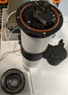]( images/O-RING-INSTALLATION/ALLSKY-CAMERA-O-RING-VERSION-OPTICAL-COVER-REMOVED.jpg )
+ Top view of allsky camera with dome installed
  + [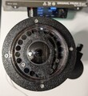]( images/ALLSKY-CAMERA-O-RING-VERSION-TOP-VIEW-CLOSEUP.jpg )
+ Top view of allsky camera showing dome, cover, poll mount and weather sensor
  + [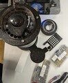]( images/ALLSKY-CAMERA-O-RING-VERSION-WITH-POLL-MOUNT.jpg )
+ Bottom view of allsky camera showing PG7 Qwiic connector and weatherproof ethernet connection
  + [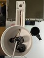]( images/BOTTOM-COVER-AND-WEATHER-SENSOR/ALLSKY-CAMERA-BOTTOM-VIEW-CLOSEUP.jpg )
+ Inside view of poll mount
  + Note: this fits on the top of a pipe
  + [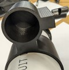]( images/MOUNTING/ALLSKY-POLLTOP-MOUNT-ADAPTER.jpg )

### Older Gasket Version
[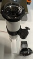]( images/OPTICAL-DONE-GASKET-VERSION/ALLSKY-CAMERA-WITH-GASKET-COVER-VERSION.jpg )
[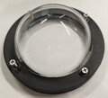]( images/OPTICAL-DONE-GASKET-VERSION/OPTICAL-DOME-COVER-GASKET-VERSION.jpg )

## Raspberry PI
### Raspberry PI GPIO header Pinouts
+ Credits https://cdn.sparkfun.com/assets/learn_tutorials/1/5/9/5/GPIO.png
  + [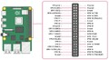]( images/RPI-INSTALLATION/RPI-GPIO-PINOUT.jpg )
+ Pinout Used for either Raspberry Pi 4 or 5
    | Pin | Function | Pin | Function |
    |---|---|---|---|
    | 1 | 3.3v | 2 | 5V |
    | 3 | SDA | 4 | 5V  FAN Red Wire|
    | 5 | SCL | 6 | GND  FAN Black Wire|
    | 7 | Not Used | 8 | Not Used |
    | 9 | GND | 10 | Not Used |

### Raspberry Pi assembly
+ Raspberry PI 5 assembly stack with the Hacker Gadgets Raspberry Pi 5 POE+ and NVME HAT
  + Note: there is an internal weather sensor to measure temperature and humidity while testing
  + When this sensor is not used yiu need an fmeal to femail Qwiic adapter or multiport adapter to connect the RPI Qwiic connection to the external BME280 sensor
  + Side view
    + [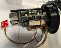]( images/RPI-INSTALLATION/SIDE-VIEW-OF-RASPBERRY-PI-5-WITH-CAMERA-ASSEMBLY.jpg )
  + Top View
    + [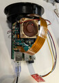]( images/RPI-INSTALLATION/TOP-VIEW-OF-RASPBERRY-PI-5-WITH-CAMERA-ASSEMBLY.jpg )

### Qwiic I2c cable pinouts
+ Used to map cable colors for Qwiic female to JST female adapter cable
    | Pin | Function | Color | Alternate Color |
    |---|---|---|---|
    | 1 | GND | BLACK | |
    | 2 | VCC 3.3V | READ | |
    | 3 | SDA | BLUE | GREEN |
    | 4 | SCL | YELLOW | WHITE |
    

### Raspberry Pi 4 Waveshare Poe HAT version E 
+ Waveshare POE HAT (E) https://www.waveshare.com/wiki/PoE_HAT_(E)
  + Pinout Pin side view components face up
    + Left to Right, Top to Bottom

    | ROW | 1 | 2 | 3 | 4|
    |---|---|---|---|---|---|
    | Top Row FAN Connections | GND | 5V | 5V | GND |
    | Bottom Row QWIIC I2C Connections | GND | 3.3V | SDA | SCL |

### Raspberry Pi 5 POE HAT pinout 
+ Hacker Gadgets Raspberry Pi 5 PoE+ and NVME Hat
  + [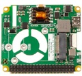]( images/RPI-INSTALLATION/Hacker-Gadgets-Raspberry-Pi-5-PoE-and-NVME-HAT.jpg )

### O-RING version
+ Remove support material from 3D print using a fine flat screw driver
  + insert vertically into the support gap and gently pry up repeat process every 30 degrees until the support releases
  + [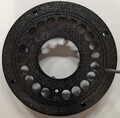]( images/O-RING-INSTALLATION/TOP-ASSEMBLY-REMOVING-3D-PRINTER-SUPPORTS-FOR-O-RING.jpg )
+ O-Ring instalation
  + Lay O-Ring on top of O-Ring slot on print
	+ To avoid stretching o-ring press down into slot using thumbs first at 180 degrees apart, then 90, the 45, etc, until the oring is fully inserted
  + O-Rings used for top assembly
    + [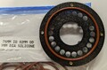]( images/O-RING-INSTALLATION/TOP-ASSEMBLY-O-RING-INSTALLATION.jpg )
  + O-Ring installed in top assembly
    + [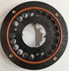]( images/O-RING-INSTALLATION/TOP-ASSEMBLY-O-RING-INSTALLED.jpg )
  + O-Rings used for top cover
    + [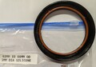]( images/O-RING-INSTALLATION/TOP-COVER-O-RING-INSTALLATION.jpg )
  + O-Ring installed in top cover
    + [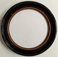]( images/O-RING-INSTALLATION/TOP-COVER-O-RING-INSTALLED.jpg )
  + O-Rings top cover and optical dome parts
    + [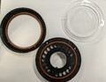]( images/O-RING-INSTALLATION/TOP-COVER-OPTICAL-DOME-O-RINGs.jpg )
  + O-Rings top cover and optical dome fitted
    + [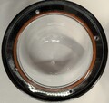]( images/O-RING-INSTALLATION/TOP-COVER-O-RING-AND-DOME-INSTALLED.jpg )
  + Dome, Top Cover and main assembly test fit
    + [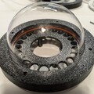]( images/O-RING-INSTALLATION/TOP-ASSEMBLY-TEST-FIT-WITH-DOME-AND-COVER.jpg )
### Heatset Inserts
+ Heatset Inserts for CNC Kitchen required for this project
+ These inserts have a narrow lip that fits into the deigned holes
  + [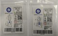]( images/HEAT-SET-INSERT-INSTALLATION/HEAT-SET-INSERT-REQUIRMENTS-FOR-THIS-PROJECTS-CAD-DESIGN.jpg )
+ Using a soldering iron to heatset - melt inserts into project holes
  + [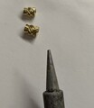]( images/HEAT-SET-INSERT-INSTALLATION/SOLDERING-IRON-TIP-AND-INSERTS.jpg )
    + I just use the default soldering temperature of 350C for doing this
    + Make sure you throughly clean soldering oron tip
    + Suggest using a wet paper towel when the iron is hot - the steam will help with cleaning
    + Make sure you keep the soldering iron vertical 
    + Let insert melt into part untill just below surface
    + [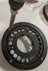]( images/HEAT-SET-INSERT-INSTALLATION/HOWTO-INSTALL--HEAT-SET-INSERTS.jpg )

#### Heatset insert locations
+ M3 x 5.7 inserts are used for holding CPU support onto top assembly with M3 x 12mm flat head tapered philips screws
+ M2.5 x 4 inserts are used for holding camera circuit board onto top assembly and RPI onto CPU support 
  + [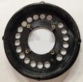]( images/HEAT-SET-INSERT-INSTALLATION/TOP-ASSEMBLY-CAMERA-HEAT-SET-INSERTS-BEFORE-INSERTION.jpg )
  + [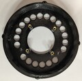]( images/HEAT-SET-INSERT-INSTALLATION/TOP-ASSEMBLY-CAMERA-SIDE-HEAT-SET-INSERTS-AFTER-INSERTION.jpg )
  + 
  + [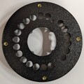]( images/HEAT-SET-INSERT-INSTALLATION/TOP-ASSEMBLY-DOME-SIDE-HEAT-SET-INSERTS-AFTER-INSERTION.jpg )
  + [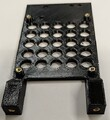]( images/HEAT-SET-INSERT-INSTALLATION/TOP-ASSEMBLY-RPI-SUPPORT-HEAT-SET-INSERTS-INSTALLED.jpg )
  + [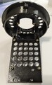]( images/HEAT-SET-INSERT-INSTALLATION/TOP-ASSEMBLY-WITH-SUPPORT-NO-RPI.jpg )

### Weather Sensor
  + Sparkfun BME280 wearther sensor installation
    + Uses M3 x 5.7 heat set inserts - note the are other M2.5 insert holes for another sensor you can ignore
    + [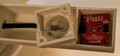]( images/BOTTOM-COVER-AND-WEATHER-SENSOR/WEATHER-SENSOR-AND-COVER.jpg )
  + Glue 15/16" faucet screen into inside of top cover with hot-glue
  + Secure cover with M3 x 15 philip panhead screws
    + [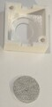]( images/BOTTOM-COVER-AND-WEATHER-SENSOR/WEATHER-SENSOR-COVER-AND-SCREEN.jpg )

### Weatherproof Gaskets
+ Secure PG7 and RJ45 feedtrough to bottom cover and weather sheald holder
  + The RJ45 has a cover for the inside and outside
  + I am using a 2ft ultrathin cat 5e ethernet cable
    + The weather glad that goes over the jack seals on the headshell of the RJ45 and seals fully
  + The PG7 is used to pass the 500mm Qwiic cable to the weather sensor
    + I rapped some self sealling fusion selicone tape around the Qwiic cable to ensure a seal with the PG7 cable gland
  + [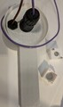]( images/BOTTOM-COVER-AND-WEATHER-SENSOR/BOTTOM-VIEW-WEATHER-SENSOR-INSIDE-ASSEMBLY-VIEW.jpg )

### Magnetic Focus Adjustment
  + This permits moving the focus point using a strong external magnet 
  + [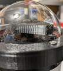]( images/MAGNETIC-FOCUS/MAGNETIC-FOCUS-ADJUSTMENT.jpg )

### Image Examples
[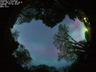]( images/IMAGES-AURORA-20240511022821.jpg )
[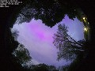]( images/IMAGES-AURORA-20240511043441.jpg )

