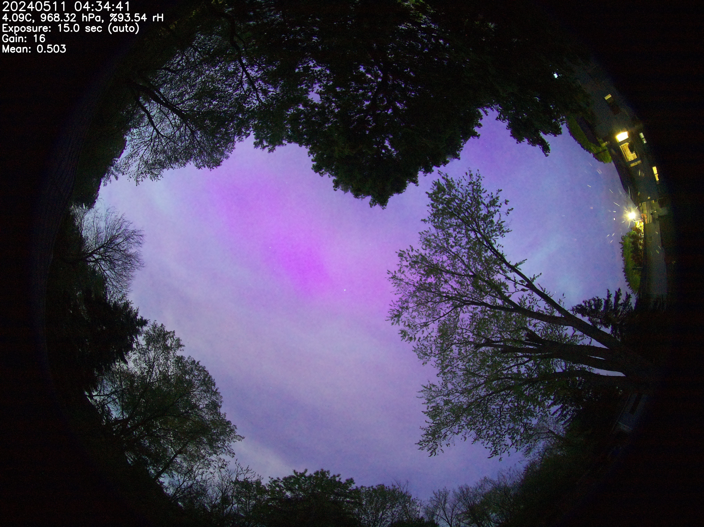

# allsky-rpi-hq-camera-enclosure

## AllSky enclosure for Raspberry Pi and HQ Camera 
* Includes CAD models in Fusion 360 

* Supports Raspberry Pi 4 and 5 Models 

* Supports optional Ethernet with POE hats 

* Includes BME280 Weather Sensor with Temperature, Humidity and Ait Pressure 

## Backround of this project
  * I started the ALLSKY Camera Enclosure project back in 2020 and have been using versions of it for the past several years
  * I created CAD models using Fusion 360 
  * I am now at the point where I feel comfortable with the design so I am completing documention presently

## Software requirement
https://github.com/AllskyTeam/allsky - this runs on the Raspberry PI 

## Hardware requirements
* Not all hardware listed is used - it depends on the Raspberry Pi version 4 or 5 and POE Hat used
* I used kits of stainless steel screws, brass hex spacers and JST connectors so specific part numbers for those items are not included. You can find them on Amazon

| Description | Source 1 | Source 2|
|---------|----------|--------------------|
| LOCK RING M12X0.5| Digikey 2938-2000035198-ND | Basler Inc. 2000035198 |
| Raspberry Pi HQ Camera Sony IMX477 | Digikey  2648-SC1220-ND | [LINK](https://www.raspberrypi.com/products/raspberry-pi-high-quality-camera/ ) | 
| 12MP 1.85MM ULTRA WIDE ANGEL | Digikey 4555-ED-LENS-M12-170185-12-ND | EDATEC ED-LENS-M12-170185-12 |
| CS-MOUNT TO S-MOUNT ADAPTER | Digikey 2938-2000035953-ND | Basler Inc.  2000035953 |
| Raspberry Pi 4 Camera Cable 200mm | | |
| Raspberry Pi 5 Shielded Camera Cable 200mm | [LINK](https://www.raspberrypi.com/products/camera-cable/ ) | |
| Raspberry Pi 5 CORSAIR MP600 MINI 1TB M.2 NVMe PCIe x4 Gen4 2 SSD 2230 | [LINK]( https://www.amazon.ca/dp/B0D9MJCFNK ) | [LINK]( https://www.amazon.com/dp/B0D9MJCFNK ) |
| QWIIC BME280 ATMOSPHERIC SENSOR | DigiKey 1568-15440-ND | SparkFun 15440 |
| Sparkfun Qwiic Multiport BOB-18012 | Digikey 1568-18012-ND | Sparkfun BOB-18012 | 
| SparkFun Qwiic Cable BOB-18012 | 1568-15081-ND | Sparkfun BOB-18012 | 
| SCREEN Cover - using Faucet Aerator Parts 15/16" | [LINK]( https://www.amazon.ca/dp/B08XNRCDV6 ) | [LINK]( https://www.amazon.com/dp/B08XNRCDV6 ) |
| Noctua NF-A4x10 5V 40x10mm PREMIUM FAN | [LINK](https://noctua.at/en/products/fan/nf-a4x10-5v ) | |
| Goalake Poe Managed 5 Port Gigabit Switch | [LINK](https://www.amazon.ca/dp/B0D2X4M1R7 ) | [LINK](https://www.amazon.com/dp/B0D2X4M1R7 ) |
| Ethernet LAN Cable Coupler Outdoor Adapter Weatherproof Connection (6-Pack ) | [LINK](https://www.amazon.ca/dp/B08GPB8M6B ) | [LINK](https://www.amazon.com/dp/B08GPB8M6B ) |
| Waveshare Raspberry Pi 4 POE HAT (E) | [LINK](https://www.amazon.ca/dp/B0BKK6FXRJ ) | [LINK](https://www.amazon.com/dp/B0BKK6FXRJ ) |
| Hacker Gadgets Raspberry Pi 5 POE+ Nvme Hat | [LINK](https://hackergadgets.com/products/nvme-and-poe-hat-for-raspberry-pi-5 ) | |
| (untested ) Waveshare PCIe To M.2 Adapter With PoE Function (C ) For Raspberry Pi 5, Supports NVM | [LINK](https://www.waveshare.com/poe-m.2-hat-plus-c.htm ) | |
| CNC Kitchen Heatset Inserts M3 x 5.7 | [LINK](https://cnckitchen.store/products/heat-set-insert-m3-x-5-7-100-pieces ) | |
| CNC Kitchen Heatset Inserts M2.5 x 4 | [LINK](https://cnckitchen.store/products/gewindeeinsatz-threaded-insert-m2-5-standard-100-stk-pcs ) | |
| 1/4"-20 x 1 Black Thread Thumb Screw, Stainless Steel | [LINK](https://www.amazon.ca/dp/B0DC5Y3KLQ ) | [LINK](https://www.amazon.com/dp/B0DC5Y3KLQ ) |
| M3 x 12 Phillips Flat Head Stainless Machine Screw | | |
| M3 x 20 Phillips Flat Head Stainless Machine Screw | | |
| M2.5 x 6 Phillips Flat Head stainless Machine Screw | | |
| M4 x 20 Philips Pan Head Stainless Machine Screw | | |
| M4 Nuts Stainless Machine Screw | | |
| M4 Nuts Stainless Washers | | |
| M2.5 x 6 Brass Standoffs Female-Female | | |
| M2.5 x 15 Brass Standoffs Female-Female | | |
| 2 x 20 (40 Pin) Extra Tall Female 0.1 Inch Pitch Stacking Header | [LINK]( https://www.amazon.ca/Female-Stacking-Header-Compatible-Raspberry/dp/B084Q4W1PW ) | [LINK]( https://www.amazon.com/Female-Stacking-Header-Compatible-Raspberry/dp/B084Q4W1PW ) |
| JST SM female connector Kit | [LINK]( https://www.amazon.ca/dp/B07BGV7H7V ) | [LINK]( https://www.amazon.com/dp/B07BGV7H7V ) |
| ( OPTIONAL ) Micro Molex Crimper: Compatible with D-Sub, JST, JAE Connectors, 32-20AWG | [LINK]( https://www.amazon.ca/dp/B082X45D7T ) | [LINK]( https://www.amazon.ca/dp/B082X45D7T ) |
| 5x10 mm cylinder Neodymium Magnets | [LINK]( https://www.amazon.ca/dp/B0DQKTHBCN ) | [LINK]( https://www.amazon.com/dp/B0DQKTHBCN ) |
| PG7 Cable Gland  with gasket | | |
| Fusion Grip Tape - Silicone | [LINK]( https://www.amazon.ca/dp/B072QYQN7B ) | [LINK]( https://www.amazon.ca/dp/B072QYQN7B ) |
| Silicone O-Ring 82mm OD 76mm ID 3mm Width | [LINK]( https://www.amazon.ca/dp/B0DHRV93PH ) | [LINK]( https://www.amazon.com/dp/B0DHRV93PH ) |
|  Silicone O-Ring 88mm OD 82mm ID 3mm Width | [LINK]( https://www.amazon.ca/dp/B0DHRRVRNT ) | [LINK]( https://www.amazon.ca/dp/B0DHRRVRNT) |
| 5 Gram Orange Indicatining Silica Packets | [LINK]( https://www.amazon.ca/dp/B07FSZVZFV ) | [ LINK]( https://www.amazon.ca/dp/B07FSZVZFV ) |
| IPEX Ecolotube 3 inch PVC Sewer Solid Sewer Pipe 76.2mm ID 82.5mm OD | SKU # 1000659635  [LINK](https://www.homedepot.ca/product/ipex-ecolotube-3-inch-x-10-feet-pvc-sewer-solid-sewer-pipe/1000659635 ) | |
| 3.15inch/80mm w/ 4 Holes Clear Acrylic Flange Plastic | [LINK](https://www.amazon.ca/dp/B07L6FBMXF ) | [LINK](https://www.amazon.com/dp/B07L6FBMXF ) |
