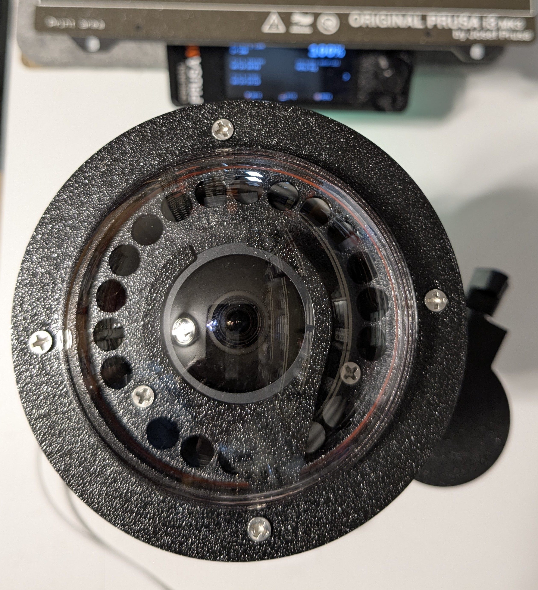
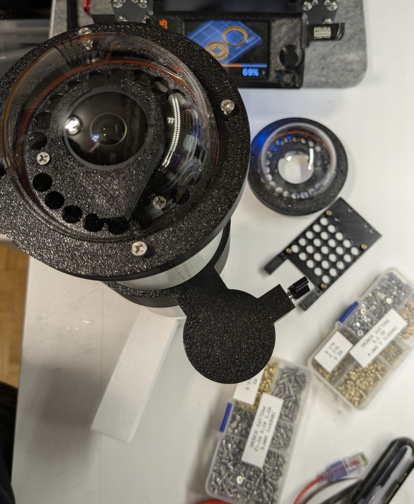
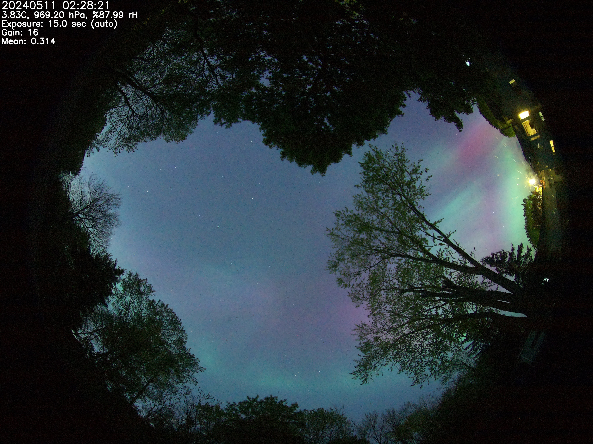

# allsky-rpi-hq-camera-enclosure

## Copyright
[MIT License Copyright 2020-2025 Mike Gore]( Copyright.md )

## AllSky enclosure for Raspberry Pi and HQ Camera 
* Includes CAD models in Fusion 360 

* Supports Raspberry Pi 4 and 5 Models 

* Supports optional Ethernet with POE hats 

* Includes BME280 Weather Sensor with Temperature, Humidity and Air Pressure 
  + I hacked in the display of Weather sensor information. I just need to convert the code to the new module format and will share that once done.

## Backround of this project
  * I started the ALLSKY Camera Enclosure project back in 2020 and have been using versions of it for the past several years
  * I created CAD models using Fusion 360 
  * I am now at the point where I feel comfortable with the design so I am completing documention presently

## Software requirement
https://github.com/AllskyTeam/allsky - this runs on the Raspberry PI 

## Hardware 

[Hardware Requirements]( HARDWARE.md )

[Assembly Instructions and Pictures]( ASSEMBLY.md )

